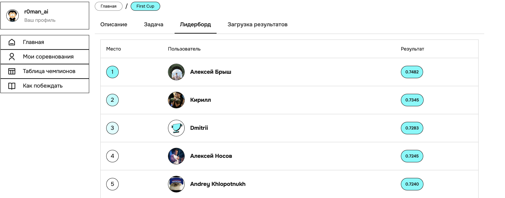
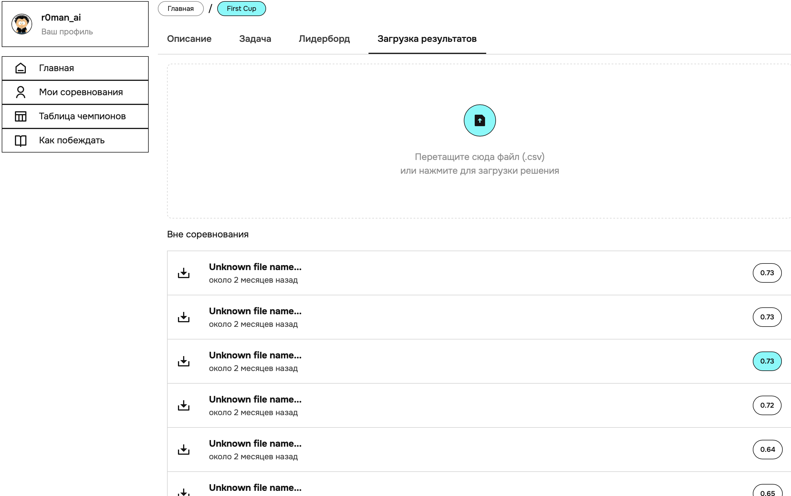

# Классификация клиентов ДодоПицца (пост-сабмит)

Задача - сделать максимально персонализированное промо предложение гостю. Что может быть в промо? Например - скидка в 10% при заказе от 1000 рублей (евро, долларов) или маленькая пицца в подарок/со скидкой. Вариантов много! Скидка также может быть предложена в процентах и в денежных единицах.  
**Наша цель - научиться предсказывать воспользуется ли человек промокодом или проигнорирует**. Чем точнее предсказание, тем более персонализированные предложения компания может делать своим клиентам.   

[Ссылка на хакатон](https://datasecrets.ru/hackathons/7?aspect=overview) (нужна регистрация, ниже приведены скриншоты лидерборда и сабмита)

**Описание данных** 
(данные по ссылке выше)

В архиве data.zip вы найдете следующие файлы:
**orders.csv** - заказы клиентов (до ноября 10 последних заказов клиента)  
•	OrderUUId - уникальный id заказа  
•	addressId - адрес доставки  
•	deliverySectorId - сектор доставки  
•	ClientUUId - уникальный id клиента  
•	Date - день заказа  
•	SaleDate - время заказа  
•	UnitUUId - уникальный id пиццерии  
•	NewClient - 1, если это первый заказ у клиента. 0 иначе  
•	ClientOrderNumber - какой по счету заказ у клиента  
•	ProductUUId - уникальный id продукта  
•	CategoryId - id категории товара  
•	ProductTotalPrice - цена продукта с учетом примененных скидок  
•	MenuPrice - цена в меню  
•	OrderState - статус заказа  
•	OrderPaymentType - тип платежа  
•	OrderTotalPrice - общая сумма заказа  
•	OrderType - тип заказа  
•	apply_promo - 1, если применялся промокод. 0 иначе  

**mobile_events.csv** - мобильные евенты (за октябрь)  
•	ClientUUId - уникальный id клиента  
•	VisitToken - токен сессии  
•	EventName- название евента  
•	Platform - платформа  
•	Timestamp - время события  

**clients_promo_october.csv** - промо выданные за октябрь  
•	ClientUUId - уникальный id клиента  
•	Id - механика  
•	LocalBeginDate - старт кампании  
•	LocalEndDate - конец кампании  
•	OrderType - тип заказа  
•	OrderPrice - порог срабатывания  
•	Discount - вознаграждение  

**train_target.csv** - промо выданные за ноябрь с фактом заказа  
•	ClientUUId - уникальный id клиента  
•	Id - механика  
•	OrderType - тип заказа  
•	LocalBeginDate - старт кампании  
•	LocalEndDate - конец кампании  
•	OrderPrice - порог срабатывания  
•	Discount - вознаграждение  
•	apply_promo- факт использования промо (таргет)  

**test.csv** - промо выданные за ноябрь без таргета  
•	ClientUUId  
•	Id  
•	OrderType  
•	LocalBeginDate  
•	LocalEndDate  
•	OrderPrice  
•	Discount  
OrderType может принимать значения 1,2 или 3, где 2,3 – ресторан, 1 – доставка.   

**Отправка результатов и оценка решения**
Cабмит должен быть представлен в виде файла, содержащим столбец apply_promo — предсказанные вероятности использования промокода.   
Нужно убедиться, что порядок строк в сабмите соответствует порядку строк в test.csv.   
В файле submit.csv представлен пример формата, в котором должен быть отправлен ответ.   
**Метрикой задачи является ROC-AUC**. Победители определяются по максимальному значению метрики.  

**Скриншоты лидерборда и лучшего сабмита:**
  

